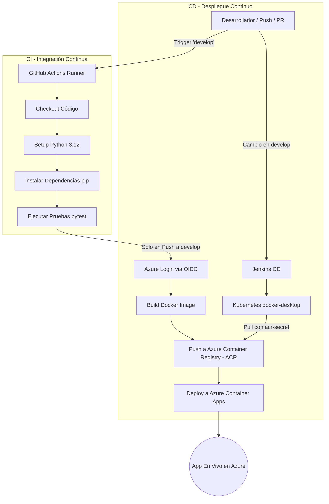
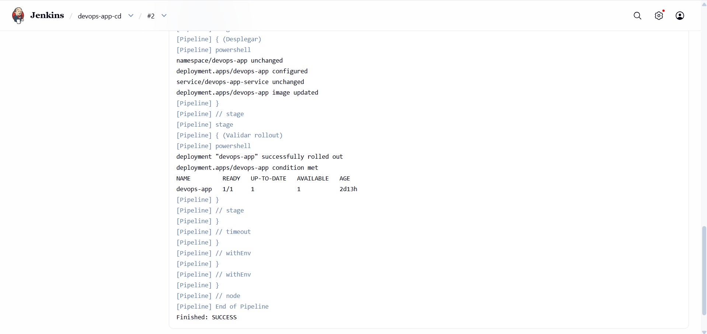
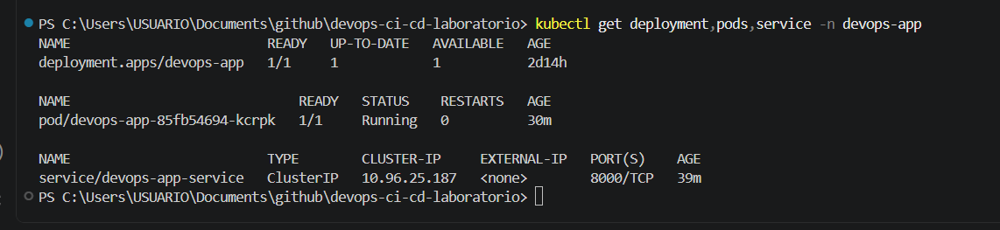
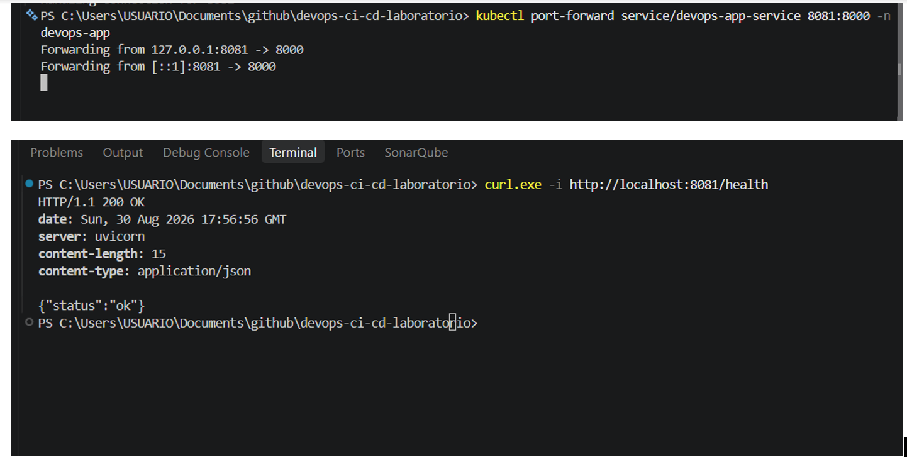

<h1 align="center">DevOps - Laboratorio CI/CD con GitHub Actions, Jenkins y Kubernetes</h1>

  
  
  
  
  
  
  
  
  
  

  <i>Automatización del ciclo de vida de una aplicación FastAPI mediante GitHub Actions, Azure Container Registry, Jenkins y Kubernetes.</i>

---

## Tabla de Contenidos
1. [Descripción General](#1-descripción-general)
2. [Arquitectura de la Solución](#2-arquitectura-de-la-solución)
3. [Infraestructura en Azure](#3-infraestructura-en-azure)
4. [Pipeline de Automatización CI/CD](#4-pipeline-de-automatización-cicd)
5. [Configuración de Secretos y Seguridad](#5-configuración-de-secretos-y-seguridad)
6. [Validación Funcional y Pruebas](#6-validación-funcional-y-pruebas)
7. [Pruebas Directas en Producción](#7-pruebas-directas-en-producción)
8. [Monitoreo, Observabilidad y Pruebas de Carga (k6 & Grafana)](#8-monitoreo-observabilidad-y-pruebas-de-carga-k6--grafana)
9. [CD con Jenkins y Kubernetes local](#9-cd-con-jenkins-y-kubernetes-local)
10. [Implementación SonarQube y Snyk](#10-Implementación-SonarQube-y-Snyk)
11. [Autores](#11-autores)

---

## 1. Descripción General

Este entregable corresponde a la fase de estructuración e implementación del pipeline de **Integración Continua (CI)** y **Entrega/Despliegue Continuo (CD)** para una aplicación web basada en **Python (FastAPI)**.

La solución utiliza **GitHub Actions** para integración continua, pruebas y publicación de imágenes en **Azure Container Registry (ACR)**. El despliegue continuo se implementa con **Jenkins**, que detecta cambios en `develop` y despliega la imagen correspondiente en un clúster local de **Kubernetes con Docker Desktop**. La autenticación entre GitHub y Azure se gestiona mediante **OpenID Connect (OIDC)**.

---

## 2. Arquitectura de la Solución

El flujo automatizado se desencadena ante eventos de `push` o `pull_request` en la rama principal de desarrollo (`develop`).

---

## 3. Infraestructura en Azure

Todos los recursos se encuentran aprovisionados en la región **Brazil South** bajo el grupo de recursos unificado `rg-cicddevopsfun`:

| Recurso | Tipo / Servicio | Nombre | Descripción |
| :--- | :--- | :--- | :--- |
| **Resource Group** | Grupo de Recursos | `rg-cicddevopsfun` | Contenedor lógico de la solución. |
| **Container Registry** | ACR | `acrfundev` | Registro privado Docker para almacenar imágenes de contenedor. |
| **Container App** | App Service / ACA | `app-cicdfundev` | Aplicación contenedora que ejecuta la API en FastAPI. |
| **Container Apps Environment**| CAE | `cae-cicdfundev` | Entorno de ejecución administrado basado en Kubernetes. |
| **Managed Identities** | Identidad OIDC | `id-cicdfundev` / `cae-cicdfundevacrfundevrg-cicddevopsfunOidc` | Identidades administradas para federación de credenciales OIDC con GitHub. |
| **Log Analytics** | Workspace | `workspace-rgcicddevopsfunIMNN` | Repositorio centralizado de logs y métricas de ejecución. |

🌐 **URL de Producción - Consola de Azure Container Apps:**  
[https://app-cicdfundev.nicebush-06dcb993.brazilsouth.azurecontainerapps.io](https://app-cicdfundev.nicebush-06dcb993.brazilsouth.azurecontainerapps.io)

  
   
  <i>Figura 1: Estado del recurso app-cicdfundev desplegado en Azure Container Apps.</i>

---

## 4. Pipeline de Automatización CI/CD

> [!NOTE]
> La integración continua y publicación de la imagen se ejecutan mediante **GitHub Actions** (`.github/workflows/ci.yml`). El despliegue continuo en Kubernetes se ejecuta mediante **Jenkins** (`Jenkinsfile`).

El flujo está definido en el archivo `.github/workflows/ci.yml` y consta de dos trabajos (*jobs*) principales:

### Job 1: `test` (Build and Test - CI)
* **Triggers:** `push` o `pull_request` sobre la rama `develop`.
* **Pasos:**
  1. **Checkout del código:** Obtiene el código fuente (`actions/checkout@v4`).
  2. **Configuración de Python:** Prepara el entorno con Python `3.12` y caché de `pip` (`actions/setup-python@v5`).
  3. **Instalación de dependencias:** Ejecuta `pip install -r requirements.txt`.
  4. **Ejecución de pruebas:** Corre el runner de pruebas automatizadas (`PYTHONPATH=. pytest -v`).

### Job 2: `deploy` (Build and Deploy - CD)
* **Condición:** Ejecución exitosa de `test` (`needs: test`) e impacto directo mediante `push` a la rama `develop`.
* **Pasos:**
  1. **Checkout del código:** Obtiene el código fuente (`actions/checkout@v4`).
  2. **Azure Login:** Autenticación segura mediante federación de identidades OIDC (`azure/login@v2`).
  3. **Build & Deploy:** Compilación de la imagen Docker etiquetada con el SHA del commit (`${{ github.sha }}`), publicación en `acrfundev.azurecr.io` y despliegue automatizado en **Azure Container Apps** (`azure/container-apps-deploy-action@v2`).

### Pipeline Jenkins: despliegue en Kubernetes

Jenkins consulta automáticamente la rama `develop`, obtiene el SHA del commit y despliega la imagen `acrfundev.azurecr.io/app-cicdfundev:<SHA>` mediante los manifiestos de `k8s/`. El pipeline valida el contexto `docker-desktop`, el namespace `devops-app` y el secret `acr-secret`; después espera el rollout y exige que el Deployment alcance la condición `Available`.

  
   
  <i>Figura 2: Ejecución exitosa de los jobs de Test y Deploy en GitHub Actions.</i>

---

## 5. Configuración de Secretos y Seguridad

El proyecto utiliza **OpenID Connect (OIDC)** con Azure Entra ID para la federación de identidades. En GitHub (`Settings > Secrets and variables > Actions`) se configuraron los siguientes secretos de repositorio:

* `APPCICDFUNDEV_AZURE_CLIENT_ID`: ID del cliente de la Identidad Administrada en Azure.
* `APPCICDFUNDEV_AZURE_TENANT_ID`: ID del Tenant (Directorio Activo) de Azure.
* `APPCICDFUNDEV_AZURE_SUBSCRIPTION_ID`: ID de la Suscripción de Azure (`a44c5d59-eae2-42db-a3ea-f55d4db896e1`).

---

## 6. Validación Funcional y Pruebas

Para validar el funcionamiento del pipeline en el repositorio:

1. **Validación de CI (Pull Request):**
   * Crear una rama de característica (ej. `feature/nueva-funcionalidad`).
   * Abrir un *Pull Request* con destino a la rama `develop`.
   * Verificar que el job `test` ejecute automáticamente la suite de pruebas.

2. **Validación de CD (Merge / Push):**
   * Realizar el *merge* del PR a la rama `develop`.
   * Verificar que se desencadenen secuencialmente los jobs `test` y `deploy`.
   * Verificar que Jenkins detecte el nuevo commit y complete el rollout en Kubernetes.
   * Validar `/health` mediante el Service `devops-app-service`.

  
   
  <i>Figura 3: Respuesta del microservicio FastAPI corriendo en el entorno de producción en Azure.</i>

---

## 7. Pruebas Directas en Producción

Se ha creado un conjunto completo de evidencias y peticiones cURL para verificar y probar los endpoints de la API desplegada directamente en *Azure Container Apps*.

> **Guía completa de Pruebas de Producción:**  
> Documentación detallada, payload de respuestas y scripts de prueba en la carpeta [`/production_test`](./production_test/README.md).

---

## 8. Monitoreo, Observabilidad y Pruebas de Carga (k6 & Grafana)

Se ha implementado e integrado un stack completo de observabilidad y pruebas de rendimiento automatizadas para la aplicación FastAPI desplegada en Azure Container Apps:

* **Endpoints de Salud y Métricas:** Adición de `/health` y `/metrics` instrumentados con `prometheus-fastapi-instrumentator` y recolector personalizado `psutil` para CPU y Memoria.
* **Stack Local Contenerizado:** Entorno en `docker-compose` con **Prometheus**, **Grafana** y **k6** con límites de recursos explícitos (`0.5` CPU, `512MB` RAM).
* **Aprovisionamiento Automático en Grafana:** Carga automatizada del dashboard de control (*FastAPI Monitoring*), fuente de datos y reglas de alerta (`HighLatencyAlert` y `HighErrorRateAlert`).
* **Pruebas de Carga (k6):** Ejecución de curva de tráfico sintética (hasta 30 usuarios virtuales) validando cumplimiento de SLOs ($p_{95}<500\text{ ms}$, $p_{99}<1000\text{ ms}$, tasa de fallos $<1\%$, disponibilidad $>99\%$).

> **Guía y Evidencias Completas de Monitoreo:**  
> Prerrequisitos, comandos de ejecución local, validaciones, arquitectura y evidencias en [`/monitoring/docs`](./monitoring/docs/README.md).

---

## 9. CD con Jenkins y Kubernetes local

El despliegue de Kubernetes se ejecuta localmente con Docker Desktop y el contexto `docker-desktop`. Esta alternativa se adoptó debido a las restricciones de la suscripción estudiantil para aprovisionar AKS, conservando los mismos conceptos de despliegue declarativo, acceso a un registro privado, probes y validación de disponibilidad.

| Componente | Configuración |
| :--- | :--- |
| Namespace | `devops-app` |
| Deployment | `devops-app` |
| Service | `devops-app-service` (`ClusterIP`, puerto `8000`) |
| Registro | `acrfundev.azurecr.io` |
| Acceso privado | `imagePullSecrets: acr-secret` |
| Salud | Readiness y liveness sobre `GET /health` |
| Automatización | Jenkins consulta `develop`, despliega el SHA y valida el rollout |

### Evidencias

  
   
  <i>Figura 4: Pipeline de Jenkins finalizado exitosamente después de aplicar los manifiestos y validar la disponibilidad del Deployment.</i>

  
   
  <i>Figura 5: Deployment disponible, Pod en estado Running y Service interno expuesto en el puerto 8000 dentro del namespace devops-app.</i>

  
   
  <i>Figura 6: Validación funcional mediante port-forward al Service y respuesta HTTP 200 del endpoint /health.</i>

## 10 Implementación SonarQube y Snyk

Se integró SonarQube Cloud al workflow de GitHub Actions para realizar un análisis automático del código Python.

El análisis se ejecuta después de las pruebas unitarias y utiliza un token almacenado como secreto de GitHub (SONAR_TOKEN), evitando exponer credenciales dentro del código fuente. La configuración del proyecto se realiza mediante sonar-project.properties.

Push a develop/main
        │
        ▼
   Build & Test
        │
        ▼
   SonarQube Cloud
        │
        ▼
 Análisis de calidad
SonarQube permite revisar métricas como:

Seguridad
Fiabilidad
Mantenibilidad
Cobertura
Duplicación de código
Issues detectados

En el código fuente se configuró el proyecto para que GitHub Actions ejecute el análisis de SonarQube sobre cada push realizado a las ramas configuradas.
Evidencia – Configuración del análisis en el repositorio:

Una vez ejecutado correctamente el pipeline, los resultados son enviados a SonarQube Cloud, donde se pueden consultar métricas relacionadas con la calidad y seguridad del proyecto, como Security, Reliability, Maintainability, Coverage y Duplications.

Evidencia – Resultado del análisis en SonarQube Cloud:

Synk

Se integró Snyk al pipeline de GitHub Actions como herramienta complementaria a SonarQube Cloud, con el objetivo de identificar vulnerabilidades conocidas en las dependencias utilizadas por la aplicación Python.
La ejecución se configuró mediante un job independiente dentro del workflow de CI/CD y analiza las dependencias definidas en requirements.txt

Se realizo la integración con losparametros anteriores y la asociación del repositio lo que nos permitio ejecutar el analisis de manera adecuada con los siguientes resultados:

El análisis de las dependencias identificó:

24 dependencias analizadas
8 vulnerabilidades/Issues encontrados
16 rutas vulnerables

Entre los problemas identificados se encontraron vulnerabilidades asociadas principalmente a la versión utilizada de Starlette (0.38.6), dependencia utilizada por FastAPI.

  

  

| Vulnerabilidad                                               | Severidad        |
| ------------------------------------------------------------ | ---------------- |
| Regular Expression Denial of Service (ReDoS)                 | **Alta**         |
| Server-Side Request Forgery (SSRF)                           | **Alta**         |
| Use of Incorrectly-Resolved Name or Reference                | **Alta**         |
| Allocation of Resources Without Limits or Throttling         | **Alta / Media** |
| Use of Externally-Controlled Input to Select Classes or Code | **Media**        |
| HTTP Request Smuggling                                       | **Media**        |

De esta manera, SonarQube y Snyk cumplen funciones complementarias: SonarQube permite evaluar aspectos de calidad, mantenibilidad y seguridad del código, mientras que Snyk permite identificar vulnerabilidades conocidas en las dependencias utilizadas por la aplicación.

Una vez se analizan esta vulnerabilidades se procede a su correcion pormedio de actualaicion de componentes en las difernetes librerias en requerimentas.txt

  

Integración con consola de Snyk
  

---

## 11. Autores 

- Camilo Jose Mora Rodriguez
- Danny Tatiana Morales Jimenez
- Juan Daniel Valderrama Pérez 
