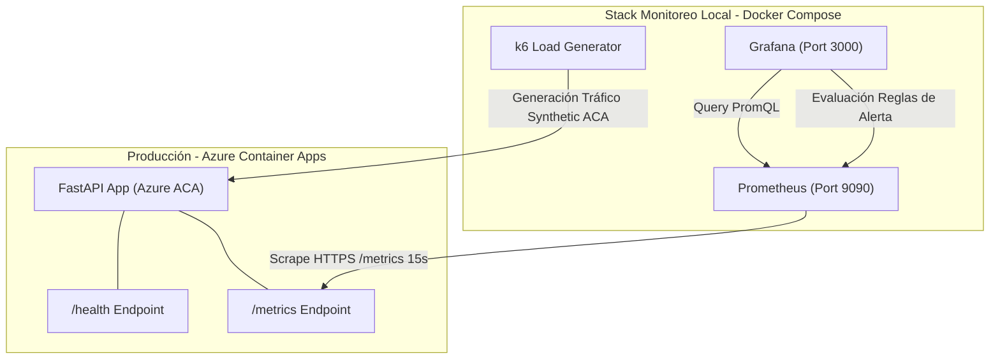
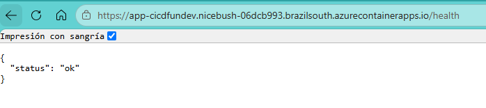
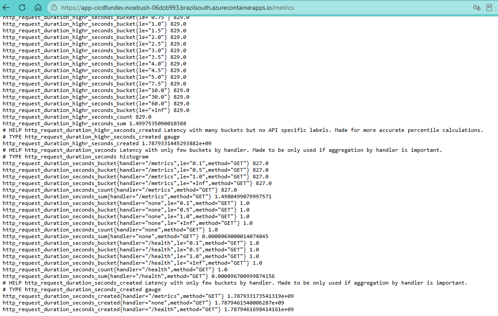
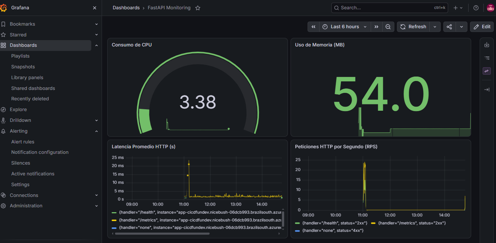
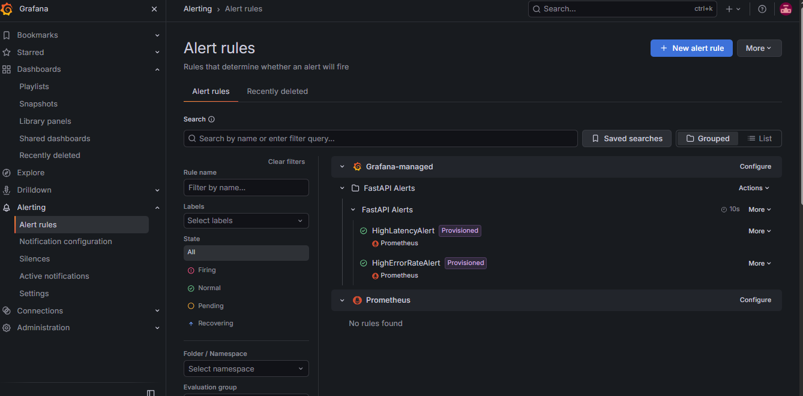
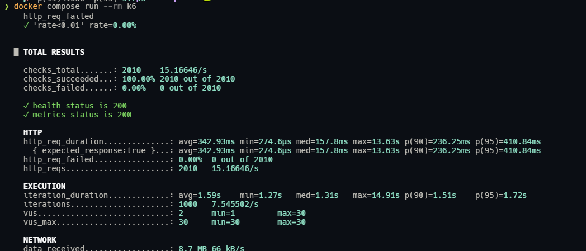

<h1 align="center">DevOps - Monitoreo, Observabilidad y Pruebas de Carga</h1>

<div align="center">
  
  
  
  
  
  
</div>

<p align="center">
  <i>Implementación e integración de un stack de observabilidad de nivel de producción con Prometheus, Grafana, alertas unificadas y validación de SLOs mediante pruebas de carga automatizadas con k6 sobre Azure Container Apps.</i>
</p>

---

## Tabla de Contenidos
1. [Descripción General](#1-descripción-general)
2. [Arquitectura de Monitoreo y Observabilidad](#2-arquitectura-de-monitoreo-y-observabilidad)
3. [Instrumentación de la Aplicación FastAPI](#3-instrumentación-de-la-aplicación-fastapi)
4. [Stack Local y Aprovisionamiento Automático](#4-stack-local-y-aprovisionamiento-automático)
5. [Monitoreo en Producción (Azure Container Apps)](#5-monitoreo-en-producción-azure-container-apps)
6. [Pruebas de Carga y Validación de SLOs (k6)](#6-pruebas-de-carga-y-validación-de-slos-k6)
7. [Reglas de Alerta Automatizadas (Grafana Alerting)](#7-reglas-de-alerta-automatizadas-grafana-alerting)
8. [Evidencias de Ejecución en Producción](#8-evidencias-de-ejecución-en-producción)

---

## 1. Descripción General

Esta sección documenta la fase de **Monitoreo, Observabilidad y Pruebas de Rendimiento** implementada para el microservicio **FastAPI** desplegado en **Azure Container Apps**.

El objetivo principal es proveer visibilidad completa de la salud del sistema en tiempo real, midiendo el uso de recursos del sistema (CPU, Memoria), métricas de peticiones HTTP (volumen de tráfico RPS, latencia y tasa de errores) y garantizando el cumplimiento de los **Objetivos de Nivel de Servicio (SLOs)** mediante alertas automatizadas y pruebas de carga sintéticas.

---

## 2. Arquitectura de Monitoreo y Observabilidad

El flujo de observabilidad conecta los endpoints instrumentados de la aplicación alojada en Azure con el stack de monitoreo contenerizado en local (Prometheus + Grafana + k6):



---

## 3. Instrumentación de la Aplicación FastAPI

La API fue estructurada e instrumentada utilizando la librería oficial `prometheus_client` y `prometheus-fastapi-instrumentator`:

* **Endpoint `/health`**: Retorna el estado de disponibilidad del microservicio (`{"status": "ok"}`).
* **Endpoint `/metrics`**: Expone métricas en formato estándar de Prometheus.
* **Métricas Personalizadas (`SystemMetricsCollector`)**: Recolecta métricas de tiempo de CPU (`process_cpu_seconds_total`) y uso de memoria en bytes (`process_resident_memory_bytes`) utilizando `psutil`.
* **Métricas HTTP**: Registra el conteo de solicitudes (`http_requests_total`) y latencia (`http_request_duration_seconds`).

---

## 4. Stack Local y Aprovisionamiento Automático

La infraestructura de observabilidad está contenida en `docker-compose.yml` e incluye aprovisionamiento 100% automatizado sin intervención manual:

### Servicios Configurados
* **Prometheus**: Recolecta métricas cada 15 segundos (`monitoring/prometheus/prometheus.yml`).
* **Grafana**: Autoregistra la fuente de datos (`monitoring/grafana/provisioning/datasources/prometheus.yml`), importa automáticamente el tablero de control (`monitoring/grafana/dashboard.json`) y carga las reglas de alerta unificadas (`monitoring/grafana/provisioning/alerting/rules.yml`).
* **Límites de Recursos**: Cada contenedor tiene límites explícitos de `0.5` CPU y `512MB` RAM.

> [!TIP]
> **Aprovisionamiento Automático:** Se eliminó cualquier dependencia de IDs aleatorios de datasource en el dashboard JSON mediante el parámetro explícito `uid: prometheus`, permitiendo que el tablero cargue métricas de forma inmediata al iniciar los contenedores.

---

## 5. Monitoreo en Producción (Azure Container Apps)

El trabajo de *scrape* en Prometheus está configurado para recopilar métricas de forma segura desde la infraestructura pública en Azure mediante HTTPS:

```yaml
scrape_configs:
  - job_name: 'fastapi-app'
    metrics_path: '/metrics'
    scheme: https
    static_configs:
      - targets: ['app-cicdfundev.nicebush-06dcb993.brazilsouth.azurecontainerapps.io:443']
```

---

## 6. Pruebas de Carga y Validación de SLOs (k6)

Se implementó una prueba de carga sintética en `monitoring/k6/load_test.js` simula rampa de usuarios virtuales (VUs) sobre los endpoints `/health` y `/metrics` en Azure.

### Curva de Tráfico y SLOs Definidos
* **Fase 1 (Ramp-up):** 10 VUs durante 30 segundos.
* **Fase 2 (Sustained Load):** 30 VUs durante 1 minuto.
* **Fase 3 (Ramp-down):** 0 VUs durante 10 segundos.

| Indicador SLO | Umbral Máximo Permitido | Resultado k6 | Estado |
| :--- | :--- | :--- | :--- |
| **Tasa de Fallos HTTP (`http_req_failed`)** | $< 1.00\%$ | **0.00%** | `PASSED` |
| **Latencia p95 (`http_req_duration`)** | $< 500\text{ ms}$ | **223.74 ms** | `PASSED` |
| **Latencia p99 (`http_req_duration`)** | $< 1000\text{ ms}$ | **385.55 ms** | `PASSED` |
| **Disponibilidad de Checks (`checks`)** | $> 99.00\%$ | **100.00%** | `PASSED` |

---

## 7. Reglas de Alerta Automatizadas (Grafana Alerting)

Se aprovisionaron dos reglas de alerta unificadas en `monitoring/grafana/provisioning/alerting/rules.yml`:

1. **`HighLatencyAlert`**: Se dispara (*Firing*) si la latencia promedio supera los **500 ms** durante 1 minuto continuo:
   $$\text{PromQL: } \frac{\text{rate}(http\_request\_duration\_seconds\_sum[1m])}{\text{rate}(http\_request\_duration\_seconds\_count[1m])} > 0.5$$

2. **`HighErrorRateAlert`**: Se dispara si la tasa de errores HTTP 5xx supera el **1%** en 1 minuto continuo:
   $$\text{PromQL: } \frac{\text{sum}(\text{rate}(http\_requests\_total\{status=\sim"5.."\} [1m]))}{\text{sum}(\text{rate}(http\_requests\_total[1m]))} > 0.01$$

---

## 8. Evidencias de Ejecución en Producción

### 8.1. Endpoints de la Aplicación en Azure Container Apps

<p align="center">
  
  <br>
  <i>Figura 1: Respuesta del endpoint /health de la aplicación desplegada en Azure Container Apps.</i>
</p>

<p align="center">
  
  <br>
  <i>Figura 2: Métricas en formato estándar de Prometheus expuestas en el endpoint /metrics en producción.</i>
</p>

---

### 8.2. Dashboard de Monitoreo en Grafana

<p align="center">
  
  <br>
  <i>Figura 3: Tablero principal de Grafana (FastAPI Monitoring) visualizando métricas de CPU, memoria, latencia y peticiones HTTP en tiempo real.</i>
</p>

---

### 8.3. Reglas de Alerta Registradas en Grafana

<p align="center">
  
  <br>
  <i>Figura 4: Reglas de alerta aprovisionadas (HighLatencyAlert y HighErrorRateAlert) evaluando de forma activa y figurando en estado Normal.</i>
</p>

---

### 8.4. Resultados de la Prueba de Carga k6

<p align="center">
  
  <br>
  <i>Figura 5: Consola de ejecución de la prueba de carga k6 confirmando el cumplimiento del 100% de los SLOs sobre la API en Azure.</i>
</p>
